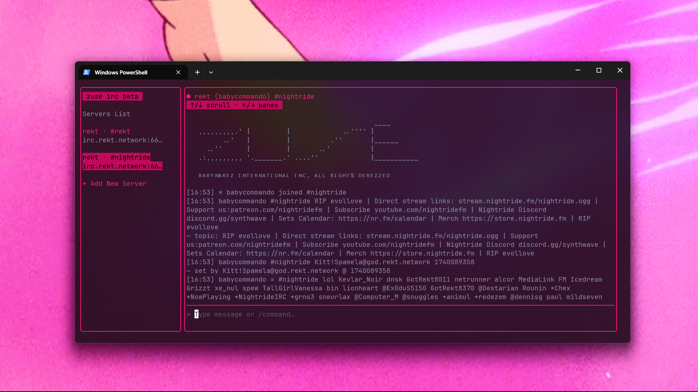
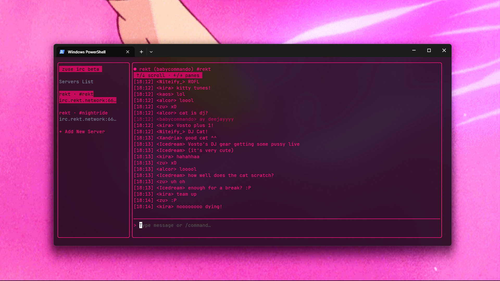
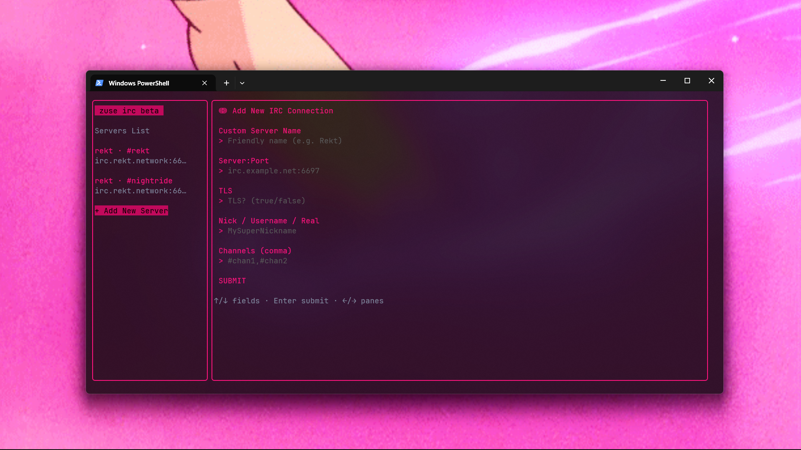

# ZUSE IRC Terminal Client

ZUSE is a sleek, minimal IRC client for your terminal. Built with Go and powered by the elegant Bubble Tea framework. Chat faster, cleaner, and without distractions right from your terminal.

ZUSE also comes pre-built on the [Nightride synthwave radio terminal client](https://github.com/babycommando/nightride-cli), give some love there!

---





---

### Installation

```
go install github.com/babycommando/zuse@latest
```

---
### Build from Source

1. Get and build:
```
git clone https://github.com/yourusername/zuse.git
cd zuse
go mod tidy
go build -o zuse # or zuse.exe on Windows
```

2. Add the compiled file to your system PATH

---

### Usage

Open a fresh terminal and type:
```
zuse
```

Enter your IRC details, pick your favorite channels, and you're good to go.

---

### Keybindings

| Key     | Action            |
|---------|-------------------|
| ↑/↓     | Scroll chat       |
| ←/→     | Switch panes      |
| Ctrl+C  | Quit              |

---

### Made With

- Bubble Tea (github.com/charmbracelet/bubbletea)
- Lipgloss (github.com/charmbracelet/lipgloss)

# Beta warning
This software is under active development, beware of bugs and missing features.
Let me know if anything went wrong at the github project issues.
